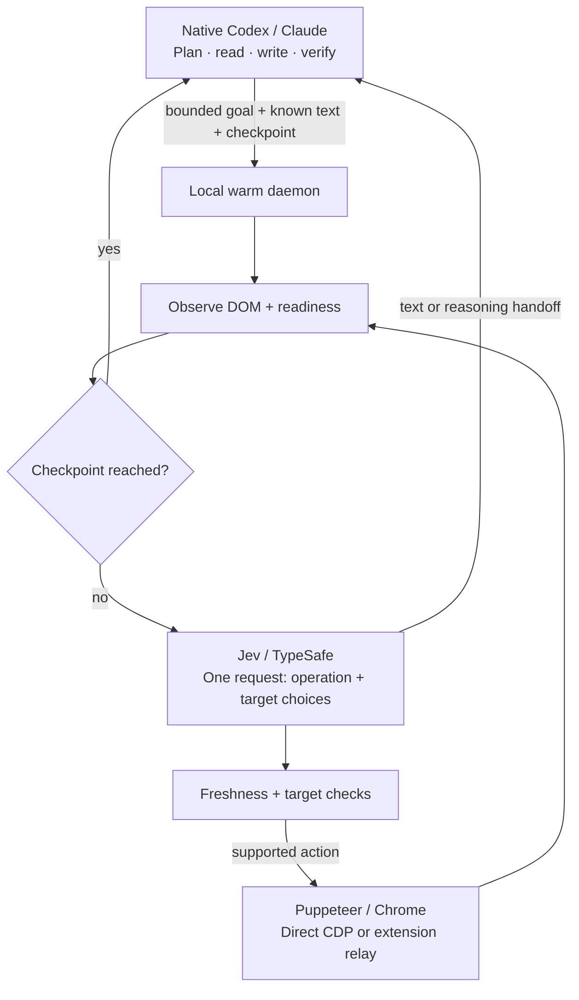

# jev-browser-use

**Jev handles the browser actions. Your Codex or Claude agent handles the thinking.**

[简体中文](README.zh-CN.md) · [Architecture](docs/architecture.md) · [Jev API & handoffs](docs/jev.md) · [CLI reference](docs/help.md)

`jev-browser-use` connects the agent you already use to a persistent Chrome browser. Give Jev a bounded goal and it
can observe, choose targets, click, type supplied text, select, scroll and wait inside one local loop. Codex or Claude
steps back in when the task needs reading, judgment, new text or an unsupported control.

The host uses its **native model and conversation** for reasoning and writing. There is no second text-model API,
recursive agent process or MCP sampling requirement. A TypeSafe/Jev key is needed only for Jev decisions; ordinary
Puppeteer scripts work without it.

This is an independent MIT-licensed project derived from [dev-browser](https://github.com/SawyerHood/dev-browser),
with Jev integration informed by [jev-ultrafast](https://github.com/browser-use/jev-ultrafast). Thank you to both teams.

## What it includes

- A compiled CLI and one warm daemon; named tabs, cookies and page state persist between calls.
- A Jev action loop with scoped freshness checks, bounded waits and explicit host handoffs.
- Known-text `inputs` and host-authored `until` checkpoints to reduce host turns and extra decisions.
- A single-submission `completion` boundary and idempotent continuation receipts.
- A Chrome extension for your existing profile, plus isolated Chrome and direct CDP connection modes.
- The same API through CLI, `page.jev()`, MCP and bundled Codex/Claude skills.
- Per-phase timings, HTTP-attempt telemetry and compact traces, with full diagnostics available on demand.

## Install

### Build from source

Use **Bun 1.3.14** (the version pinned in CI), Git, and Chrome/Chromium. The runtime supports macOS and glibc Linux
on ARM64/x64. Windows and musl Linux are not supported yet.

```bash
git clone https://github.com/AuroraPixel/jev-browser-use.git
cd jev-browser-use
bun install --frozen-lockfile
bun run build
export PATH="$PWD/dist:$PATH"
jev-browser-use --version
# Only if Chrome cannot be found:
jev-browser-use install
```

The compiled binary embeds Bun and Puppeteer; Node is not needed to run it. Add the absolute `dist` directory to your
shell PATH, or copy `dist/jev-browser-use` into a directory already on PATH.

### Prebuilt binaries and extension

[GitHub Releases](https://github.com/AuroraPixel/jev-browser-use/releases) contain `jev-browser-use-<os>-<arch>`,
`jev-browser-use-extension-<version>.zip` and `SHA256SUMS`. Download the asset matching your platform, verify its hash
against `SHA256SUMS`, rename it to `jev-browser-use`, then `chmod +x jev-browser-use` and place it on PATH.
The extension ZIP must be extracted before Chrome can load it.

**There is no npm registry release advertised by this project.** Use the source build or GitHub release above.
The repository retains a checksum-verifying npm shim for future packaging. Its optional
`JEV_BROWSER_USE_DOWNLOAD_BASE` points to a mirror containing the same binaries and `SHA256SUMS`;
`JEV_BROWSER_USE_SKIP_DOWNLOAD=1` disables downloads.

## Configure Jev

```bash
# Set your own key in the invoking shell or the MCP server's environment.
export TYPESAFE_API_KEY="<your-typesafe-key>"
# Optional; the default model is jev-latest:
export TYPESAFE_MODEL="jev-latest"
# Optional HTTP(S) proxy:
# export TYPESAFE_PROXY="http://127.0.0.1:10808"
```

See [.env.example](.env.example). A compiled CLI does not automatically read a checkout's `.env`; export the variables
in its parent process. A desktop MCP host also needs them in the server environment or a private launcher.
Never put a real key into a goal, script, tool argument or tracked file. No key is stored in the extension.

Jev receives the goal, page URL/title, visible text, candidate controls, current field values and recent action history
at `https://api.typesafe.ai/v1/systemone`. Ordinary browser scripts stay local unless the script itself accesses a
service. See [data flow and boundaries](docs/architecture.md#data-and-trust-boundaries).

## Choose your browser

| Mode | Start | Use |
| --- | --- | --- |
| Isolated browser | Automatically launched | `jev-browser-use --headless ...` (omit `--headless` for a window) |
| Existing Chrome profile | Load the bundled extension and run `jev-browser-use relay` | `jev-browser-use --connect http://127.0.0.1:9222 ...` |
| Chrome with CDP | `jev-browser-use chrome --profile work` | `jev-browser-use --connect ...` |

### Use your existing Chrome profile

1. Download and extract the extension ZIP, or build it locally:

   ```bash
   cd extension
   bun install --frozen-lockfile
   bun run build
   cd ..
   # Optional distributable ZIP in dist/:
   bun run package:extension
   ```

2. Open `chrome://extensions`, enable **Developer mode**, choose **Load unpacked**, and select the extracted folder
   containing `manifest.json` (source builds: `extension/.output/chrome-mv3`).
3. Run `jev-browser-use relay` and leave it running. Enable **Active** in the **jev-browser-use** extension popup.
   It should show **Connected to relay**.
4. Check the connection:

   ```bash
   jev-browser-use --connect http://127.0.0.1:9222 -e 'const p = await browser.getPage("main"); await p.goto("https://example.com"); await p.title()'
   ```

The extension creates a **jev-browser-use** tab group in that Chrome profile, sharing its logins. Only its managed tabs
are exposed. Use the same connection URL and runtime home for CLI and MCP: the relay permits one CDP client at a time.
Turn off an older dev-browser extension before enabling this one; both use port 9222. Do not run two relays on that port.
See [extension details and troubleshooting](docs/jev.md#chrome-extension).

## Use with Codex or Claude

Install the binary on PATH, then install the bundled skill into the host you use:

```bash
jev-browser-use install-skill --codex
jev-browser-use install-skill --claude
# Optional generic agent discovery directory:
jev-browser-use install-skill --agents
```

The skill is named **jev-browser-use**. Start a new host session if it has cached the previous skill list. Example prompt:

> Use jev-browser-use with my Chrome extension. Search for three useful Jev demos, compare them in my language,
> and include the original links. Let Jev handle navigation and use your native reasoning to compare the results.

The repository also contains `.codex-plugin/plugin.json` and a Claude plugin marketplace. These expose the skill;
installing a skill/plugin does not install the CLI, start a relay or provide a key. Claude Code users can use:

```text
/plugin marketplace add AuroraPixel/jev-browser-use
/plugin install jev-browser-use@jev-browser-use-marketplace
```

### MCP

Use an absolute binary path as the stdio server command. This generic MCP entry starts an isolated browser:

```json
{
  "mcpServers": {
    "jev-browser-use": {
      "command": "/absolute/path/to/jev-browser-use",
      "args": ["mcp", "--headless", "-t", "60"]
    }
  }
}
```

For your extension, replace `args` with `["mcp", "--connect", "http://127.0.0.1:9222", "-t", "60"]`.
Set `TYPESAFE_API_KEY` in the server's environment using your client's configuration or a private launcher.
Client config file formats vary; the command and arguments above are the actual server interface.

Tools: `jev_browser_use_run`, `jev_browser_use_jev`, `jev_browser_use_pages`, `jev_browser_use_browsers`,
`jev_browser_use_stop`, `jev_browser_use_help`. MCP and the CLI share the same daemon.

## First run

Without Jev or a key:

```bash
jev-browser-use --headless <<'JS'
const p = await browser.getPage("demo");
await p.goto("https://example.com");
console.log(await p.title());
await p.snapshot({ interactive: true });
JS
```

A Jev example using a public test page; this changes only a dropdown:

```bash
jev-browser-use --headless -t 60 <<'JS'
const p = await browser.getPage("dropdown-demo");
await p.goto("https://the-internet.herokuapp.com/dropdown");
await p.jev({
  action: "run",
  goal: "Choose Option 2 from the dropdown",
  until: { fields: [{ label: "Please select an option Option 1 Option 2", value: "2" }] }
});
JS
# The host independently verifies the actual result:
jev-browser-use --headless -e 'const p = await browser.getPage("dropdown-demo"); await p.$eval("select", e => e.value)'
```

Inspect `status` in every Jev result. For `needs_text`, the current Codex/Claude agent writes the text and resumes:

```bash
jev-browser-use --headless -t 60 jev <<'JSON'
{"page":"main","action":"resume","sessionId":"RETURNED_SESSION","requestId":"RETURNED_REQUEST","text":"host-written text"}
JSON
```

Use the returned IDs and the same page/connection settings. `needs_host` requires host inspection/reasoning before
resuming without text. `done` always remains `verified:false`; verify the requested outcome independently.
Read the [complete handoff, checkpoint and submission contract](docs/jev.md).

## Architecture



No host turn is needed for each routine click. Jev chooses among observed operations and targets; it does not generate
field text. The runtime checks freshness, executes and settles actions, stops on checkpoints, and returns explicit
continuations. The host handles semantic judgment and final verification. [Architecture and source map](docs/architecture.md).

## Limits and performance

Jev supports viewport-visible main-frame controls, open shadow DOM, clicks, native text inputs/contenteditable,
single selects, vertical scrolling and waits. Iframes, closed shadow DOM, canvas, file uploads, password fields,
multi-selects and custom widgets can require host scripts. Observation is capped at 150 candidates and 6,000 text
characters; partial observations cannot prove completion. There is no claim of universal website compatibility.

Speed depends on network, rendering, task shape and the host's handoffs. A warm daemon avoids repeated browser startup;
known inputs, checkpoints and bounded readiness waits remove avoidable host/model trips. `requests`, `trace` and
`timing` measure the actual run. Do not treat model latency as the whole task's duration. The benchmark scripts provide
repeatable local scenarios; their simulated mode is not an API speed measurement.

## Development

```bash
bun install --frozen-lockfile
bun x tsc --noEmit
bun run build
bun run test
npm pack --dry-run
# Extension dependencies are installed separately as shown above:
bun run test:extension
bun run build:extension
```

Tests use local fixtures and fake chooser decisions, without paid API calls. Opt-in real API smoke checks:
`JEV_LIVE_TEST=1 bun run scripts/smoke-jev.ts` (requires your key). For the actual extension:
`JEV_BROWSER_USE_EXTENSION_DIR="$PWD/extension/.output/chrome-mv3" bun run scripts/smoke-extension.ts`.
See [CONTRIBUTING.md](CONTRIBUTING.md) and [design decisions](docs/design-decisions.md).

Runtime state defaults to `~/.jev-browser-use/v1`; override it with `JEV_BROWSER_USE_HOME`. This is independent of upstream
state. `migrate-from-doobie` is retained as an optional legacy import; it never modifies the source. Browser input uses
a bring-to-front lock, but two scripts on one named page can still interleave—keep one active task per tab.

## Releasing

[RELEASING.md](RELEASING.md) describes the GitHub release workflow, binaries, extension ZIP and checksum verification.
Npm publication is a separate maintainer decision and is not run automatically.

## Acknowledgments and license

Thank you to **[Sawyer Hood and the dev-browser contributors](https://github.com/SawyerHood/dev-browser)** for the warm
daemon, persistent pages, Puppeteer integration, snapshots, CLI and Chrome extension that made this project possible.
Thank you to **[Browser Use / jev-ultrafast](https://github.com/browser-use/jev-ultrafast)** for the operation/target
fan-out pattern and freshness/waiting ideas, and **Jev / TypeSafe** for the decision API.

Maintained independently by [AuroraPixel](https://github.com/AuroraPixel). This is not an official product of the upstream
projects, OpenAI or Anthropic. MIT; original copyright notices are preserved in [LICENSE](LICENSE) and
[THIRD_PARTY_NOTICES.md](THIRD_PARTY_NOTICES.md).
