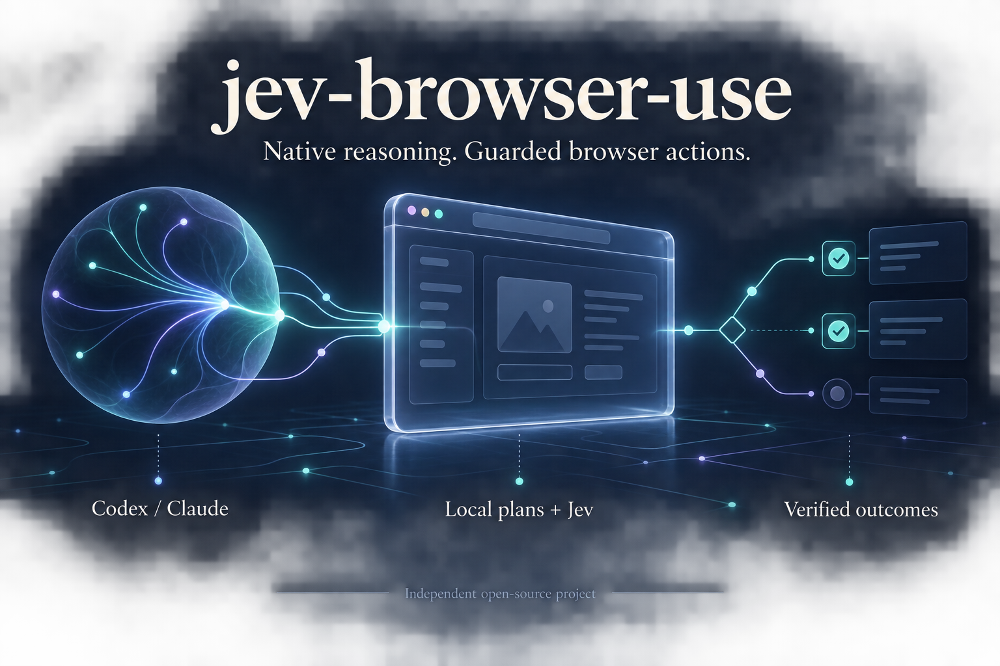
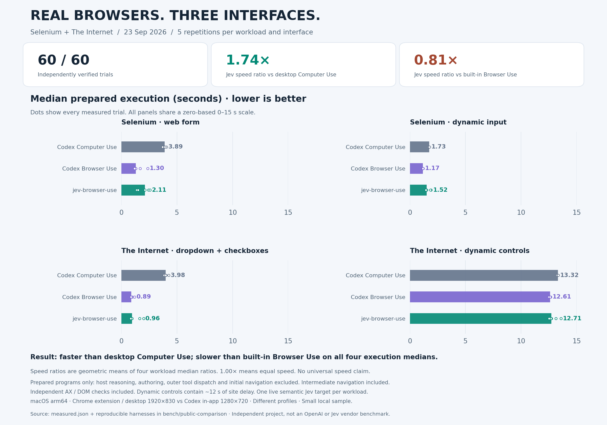

# jev-browser-use

**Jev 负责连续操作网页，Codex／Claude 负责思考、写作和验证。**

[English](README.md) · [架构说明](docs/architecture.md) · [Jev 接口与交接协议](docs/jev.md) · [完整 CLI 帮助](docs/help.md)



`jev-browser-use` 把你正在使用的 Codex 或 Claude 接入一个持续运行的 Chrome 浏览器。宿主给出一个有边界的任务，
Jev 就可以在本地循环中连续观察、选择目标、点击、输入已提供的文字、选择选项、滚动和等待。遇到需要阅读理解、
判断、撰写新文字或不支持的控件时，再把控制权交回宿主。

文字和复杂推理由当前 Codex／Claude 的原生模型与对话提供，**不需要再接一个文字模型 API**，也不会递归启动另一个
Agent。Jev 决策需要 TypeSafe Key；普通 Puppeteer 脚本无需该 Key。

这是独立维护的 MIT 开源项目，源自 [dev-browser](https://github.com/SawyerHood/dev-browser)，并参考
[jev-ultrafast](https://github.com/browser-use/jev-ultrafast) 的调用与执行设计。感谢两个项目的作者和贡献者。

## 能做什么

- CLI、MCP、`page.jev()` 和 Codex／Claude 技能使用同一个常驻 daemon。
- 命名标签页、Cookie 和登录状态可以跨调用保留。
- Jev 在一次委托中连续操作，减少每次点击都与宿主交换的开销。
- [条件计划](docs/plans.md)把已观察到的控件交给本地执行，语义不明确的目标交给 Jev；每步验证结果，
  按条件分支推进，已验证且未变化的控件绑定可以复用。普通模型仍负责计划、文字和最终检查。
- `inputs` 提前提供已知文字，`until` 用明确页面条件结束阶段，减少额外推理请求。
- `completion` 限制一次授权提交；不确定结果不会自动重复点击。
- 浏览器扩展可以使用你现有 Chrome 档案的登录态；也可以启动独立浏览器或通过 CDP 连接。
- 返回各阶段耗时、每次 HTTP 请求、动作轨迹和明确的接管原因。

## 安装

### 源码构建

需要 Git、**Bun 1.3.14** 和 Chrome／Chromium。目前支持 macOS、glibc Linux 的 ARM64／x64；不支持 Windows 和 musl Linux。

```bash
git clone https://github.com/AuroraPixel/jev-browser-use.git
cd jev-browser-use
bun install --frozen-lockfile
bun run build
export PATH="$PWD/dist:$PATH"
jev-browser-use --version
# 仅在找不到 Chrome 时执行：
jev-browser-use install
```

可执行文件已包含 Bun 和 Puppeteer，运行时不需要 Node。将 `dist` 的绝对路径加入你的 shell PATH，
或把 `dist/jev-browser-use` 复制到已有的 PATH 目录。

也可以从 [GitHub Releases](https://github.com/AuroraPixel/jev-browser-use/releases) 下载对应平台的
`jev-browser-use-<os>-<arch>`，用同页的 `SHA256SUMS` 校验后，重命名为 `jev-browser-use`，执行
`chmod +x jev-browser-use` 并加入 PATH。扩展另有 `jev-browser-use-extension-<版本>.zip`。

本项目目前不提供 npm 注册表安装承诺，请使用源码或 GitHub Release。

### 配置 Jev

```bash
export TYPESAFE_API_KEY="<你自己的 TypeSafe Key>"
# 可选，默认使用 jev-latest：
export TYPESAFE_MODEL="jev-latest"
# 可选，仅支持 HTTP(S) 代理：
# export TYPESAFE_PROXY="http://127.0.0.1:10808"
```

可以参考 [.env.example](.env.example)，但编译后的 CLI 不会自动加载 `.env`。请在调用它的进程环境中配置，
桌面 MCP 客户端则使用服务器环境变量或私有启动脚本。不要把真实 Key 写进任务、工具参数或提交到仓库。
扩展中没有 Key。Jev 会收到目标、页面 URL／标题、可见文字、候选控件、字段当前值和近期动作历史。

## 连接你的 Chrome 插件

1. 下载扩展 ZIP 并解压，或者在仓库中构建：

   ```bash
   cd extension
   bun install --frozen-lockfile
   bun run build
   cd ..
   # 可选：打包到 dist/：
   bun run package:extension
   ```

2. 打开 `chrome://extensions`，开启开发者模式，点击「加载已解压的扩展程序」。选择包含 `manifest.json`
   的解压目录；源码构建对应 `extension/.output/chrome-mv3`。
3. 运行 `jev-browser-use relay` 并保持运行。打开 **jev-browser-use** 扩展弹窗，将 **Active** 打开，
   确认显示 **Connected to relay**。
4. 执行连接检查：

   ```bash
   jev-browser-use --connect http://127.0.0.1:9222 -e 'const p = await browser.getPage("main"); await p.goto("https://example.com"); await p.title()'
   ```

扩展在当前 Chrome 档案中创建 **jev-browser-use** 标签组，共享该档案的登录状态，只暴露它管理的标签页。
CLI 与 MCP 必须使用相同的连接地址和 `JEV_BROWSER_USE_HOME`。一个 relay 同时只允许一个 CDP 客户端。
旧 dev-browser 扩展也使用 9222，请先关闭旧扩展，不要同时启动两个 relay。

若不需要已有登录态，直接使用 `jev-browser-use --headless ...` 即可自动启动独立浏览器；省略 `--headless`
则显示窗口。还可以用 `jev-browser-use chrome --profile work` 启动专用 CDP 档案，再用 `--connect` 连接。

## 在 Codex／Claude 中使用

将 CLI 加入 PATH，然后安装技能：

```bash
jev-browser-use install-skill --codex
jev-browser-use install-skill --claude
# 其他支持通用技能目录的 Agent：
jev-browser-use install-skill --agents
```

技能名称是 **jev-browser-use**。若宿主已缓存技能列表，请开始一个新会话。可以这样提问：

> 使用 jev-browser-use 连接我的 Chrome 插件。找三个有价值的 Jev 演示，用中文比较并给出原始链接。
> 导航交给 Jev，阅读比较由你自己完成。

仓库包含 Codex 插件描述和 Claude 插件 marketplace，它们加载同一份技能。插件安装不会自动安装 CLI、启动 relay 或配置 Key。
Claude Code 也可以执行：

```text
/plugin marketplace add AuroraPixel/jev-browser-use
/plugin install jev-browser-use@jev-browser-use-marketplace
```

### MCP 方式

MCP 服务器使用二进制绝对路径，stdio 参数如下：

```json
{
  "mcpServers": {
    "jev-browser-use": {
      "command": "/absolute/path/to/jev-browser-use",
      "args": ["mcp", "--headless", "-t", "60"]
    }
  }
}
```

连接扩展时，将 `args` 改为 `["mcp", "--connect", "http://127.0.0.1:9222", "-t", "60"]`。
通过客户端的服务器环境配置或私有启动脚本提供 `TYPESAFE_API_KEY`。不同客户端配置文件格式可能不同。

工具统一命名为 `jev_browser_use_run`、`jev_browser_use_jev`、`jev_browser_use_pages`、
`jev_browser_use_browsers`、`jev_browser_use_stop`、`jev_browser_use_help`。

## 最小示例

先跑普通脚本，不需要 Jev Key：

```bash
jev-browser-use --headless <<'JS'
const p = await browser.getPage("demo");
await p.goto("https://example.com");
console.log(await p.title());
await p.snapshot({ interactive: true });
JS
```

然后让 Jev 操作一个公开测试页的下拉框：

```bash
jev-browser-use --headless -t 60 <<'JS'
const p = await browser.getPage("dropdown-demo");
await p.goto("https://the-internet.herokuapp.com/dropdown");
await p.jev({
  action: "run",
  goal: "Choose Option 2 from the dropdown",
  until: { fields: [{ label: "Please select an option Option 1 Option 2", value: "2" }] }
});
JS
# 宿主独立检查实际选中值，应为 2：
jev-browser-use --headless -e 'const p = await browser.getPage("dropdown-demo"); await p.$eval("select", e => e.value)'
```

收到 `needs_text` 时，Codex／Claude 自己撰写文字，并带上原样返回的 `sessionId`、`requestId`、
`action:"resume"` 和 `text` 继续。`needs_host` 要先阅读原因并处理，再不带文字地恢复。
所有调用保持相同的浏览器和连接设置。即使 `done`，也仍是 `verified:false`，需要宿主检查实际结果。

## 架构与分工

| 组件 | 负责什么 |
| --- | --- |
| Codex／Claude 原生模型 | 规划、阅读理解、比较、写文字、处理异常、最终验证 |
| Jev／TypeSafe | 根据当前观察，在一次请求中选择动作及候选目标；决定何时交还宿主 |
| 本地执行器 | 观察与就绪判断、目标新鲜度检查、动作执行、等待、检查点、提交边界、日志与计时 |
| Chrome／扩展 | 执行浏览器动作，保持页面与登录态；relay 将扩展协议桥接为 CDP |

宿主把任务切成可验证的阶段，提前提供已知文字，让 Jev 在阶段内连续运行。
运行器在明确条件满足时直接返回，不必再向 Jev 询问是否结束。遇到新内容需要判断时，Jev 交回宿主，
宿主完成思考后继续同一会话，或结束旧目标再启动下一阶段。[完整架构图、数据流和源码位置](docs/architecture.md)。

## 支持范围和速度

Jev 支持视口内主页面 DOM、开放 Shadow DOM、点击、普通输入框和 contenteditable、原生单选下拉框、
垂直滚动、等待。iframe、封闭 Shadow DOM、Canvas、上传、密码、多选和复杂自定义控件可能需要宿主脚本。
观察上限为 150 个候选控件和 6,000 字符；截断观察不能证明完成。不承诺适配所有网页。

常驻进程、连续动作、预填文字、确定性检查点和就绪等待减少额外调用，但总速度仍受网络、页面加载和宿主思考影响。
`timing`、`requests`、`trace` 可以测量真实调用。模拟基准不能当作真实 API 速度，单个样本也不能代表所有网站。

## 真实浏览器对比

**最新可靠性修复：**[真实 12306 自动补全回归报告（英文）](docs/benchmarks/2026-09-24-autocomplete/report.md)。
已安装的扩展正确修改了实际站码，仅查询一次便返回目标线路；活跃执行 4.442 秒、6 次 Jev 请求、零宿主接管。
准备阶段另计，整条命令为 10.963 秒；461 项核心测试通过。这是正确性验证，不是与 Codex 的速度比较。

2026 年 9 月 23 日，在 Selenium 官方测试页和 The Internet 上完成 **60 次正式测试，全部通过独立验证**：
4 项流程 × 每项 5 轮 × 3 种真实接口。按四项流程执行时间中位数比值的几何平均计算，Jev 相对桌面版
Codex Computer Use 为 **1.74×**，相对 Codex 内置 Browser Use 为 **0.81×**，后者意味着执行耗时约多 **23%**。
这些结果不能支持“全面快于 Codex”的宣传，因此此次没有发布推广帖或比较回复。



| 执行时间中位数，秒（越低越好） | 桌面 Computer Use | 内置 Browser Use | Jev |
| --- | ---: | ---: | ---: |
| Selenium 表单 | 3.892 | 1.296 | 2.111 |
| Selenium 动态输入 | 1.734 | 1.165 | 1.516 |
| The Internet 下拉与复选框 | 3.982 | 0.887 | 0.958 |
| The Internet 动态控件 | 13.321 | 12.610 | 12.714 |

测试使用提前观察、编写好的流程；计时包含独立 AX／DOM 验证，不包含宿主思考、编写计划、外层工具调度和
初始导航，但包含流程中的跨页导航。三组沿用各自默认视口和浏览器档案，存在环境差异；动态控件任务约有
12 秒网站自身等待。**这不是完整 Agent 端到端耗时，也不是所有网页的通用结论。**

[完整报告](docs/benchmarks/2026-09-23/report.md)包含全部原始测量、导航与流程总耗时、环境、预跑问题和复现脚本。
上方架构海报由内置 image 工具生成，测试报告图由真实数据绘制；Jev 共执行 85 个浏览器动作，调用真实 API 22 次。

### 分开验证：执行器与完整宿主流程

[9 月 24 日的独立报告](docs/benchmarks/2026-09-24/report.md)保留上一轮结果，另外测量两个不同层次：

**实测亮点：Selenium 表单中，jev-browser-use 本地计划的执行速度为 Codex 内置 Browser Use 的
1.94×（接近 2×）。** 执行时间中位数为 **1.159 秒 → 0.596 秒**，每组 5 次，全部通过验证。
两组均使用已知控件；计时包含结果验证，排除初始导航、宿主推理、程序编写和外层工具调度。
本地计划的 **Jev 模型调用为 0**，没有事后扣除模型响应时间。这是单项结果，整体成绩如下。

- **执行器组：40 / 40 通过，每项每组 5 次。** 已知控件全部走 Jev 本地计划，模型调用为 **0**。
  内置 Browser Use／Jev 耗时中位数比值的几何平均，执行阶段为 **1.34×**，加上初始导航为 **1.02×**，
  后者接近持平。这是框架本地执行路径的结果，不是 Jev 模型推理速度。
- **完整流程组：6 / 6 通过，每项每组各 1 次。** 内置 Browser Use／Jev 的完整耗时分别为：
  计数与等待 **70.0／45.8 秒**，读表判断 **183.4／107.8 秒**，嵌套 frame **63.4／73.2 秒**。
  Jev 共调用模型 API 19 次，实际触发一次不支持 frame 的接管；宿主浏览器工具调用合计从 17 次降到 9 次。


完整流程在同一宿主上下文内依次完成，存在顺序影响和很大的工具外耗时波动，属于探索性实测，不能当作模型速度排名。
错误和恢复均计入。两组计时边界不同，不能合并，也不能据此宣传全面快于 Codex。
[完整数据、日志摘要、协议和限制](docs/benchmarks/2026-09-24/report.md)。

## 开发与发布

```bash
bun install --frozen-lockfile
bun x tsc --noEmit
bun run build
bun run test
npm pack --dry-run
# 先安装 extension/ 的依赖：
bun run test:extension
bun run build:extension
```

常规测试只用本地页面与假模型，不消费 API。自愿开启真实测试：
`JEV_LIVE_TEST=1 bun run scripts/smoke-jev.ts`。真实扩展测试：
`JEV_BROWSER_USE_EXTENSION_DIR="$PWD/extension/.output/chrome-mv3" bun run scripts/smoke-extension.ts`。

默认运行目录是 `~/.jev-browser-use/v1`，可以用 `JEV_BROWSER_USE_HOME` 改写，独立于旧项目。
发布步骤见 [RELEASING.md](RELEASING.md)，贡献说明见 [CONTRIBUTING.md](CONTRIBUTING.md)。

## 致谢与许可

特别感谢 **[Sawyer Hood 和 dev-browser 贡献者](https://github.com/SawyerHood/dev-browser)** 提供常驻 daemon、
Puppeteer 执行、持久标签页、页面快照、CLI 和 Chrome 扩展基础；感谢
**[Browser Use / jev-ultrafast](https://github.com/browser-use/jev-ultrafast)** 的操作与目标并行选择、
新鲜度检查和等待设计；感谢 **Jev / TypeSafe** 提供决策 API。

由 [AuroraPixel](https://github.com/AuroraPixel) 独立维护，并非上游项目、OpenAI 或 Anthropic 的官方产品。
采用 MIT 许可，保留原作者版权及许可声明，详见 [LICENSE](LICENSE) 和 [THIRD_PARTY_NOTICES.md](THIRD_PARTY_NOTICES.md)。
