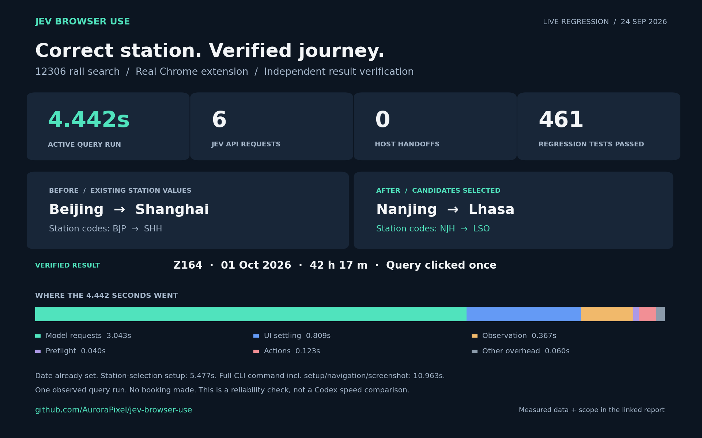

# Autocomplete correctness on a real 12306 workflow

**The installed Chrome-extension workflow changed the actual station identities from Beijing/Shanghai to
Nanjing/Lhasa, queried once, and returned the correct Z164 result. The active query run took 4.442 seconds,
with six Jev API requests and no host handoff.** This is a functional regression check, not a comparison with Codex.

## What failed and what changed

A text field can display a new station name while its submitted station code still identifies the old city.
The query heading can echo that text even when the returned trains belong to the old route. The earlier executor
wrote the display value without completing the picker, and goal-only DONE could be accepted on an incomplete
observation with low confidence.

On 12306, the public station-picker code initializes on the first mouseover, populates suggestions through keyboard
events, and commits the station code when a candidate is selected. DOM focus and a value assignment alone skip
part of that sequence. The fix activates recognized pickers with native pointer movement, triggers their keyboard
listeners, and keeps candidate selection in Jev's loop. It does not write station codes directly.

Pending selections now prevent unrelated edits or submission. Nearby matching hidden identity values are used
only by local consistency guards and are not added to the model payload. Standard ARIA pickers are also tracked.
The new `rows` checkpoint requires the requested fragments to occur in the same rendered data row; query headings
and fragments in different rows cannot satisfy it. Goal-only DONE hands off on incomplete observations, pending
selection or confidence below 0.5 by default. All `done` responses still require independent host verification.

## Measurements and boundaries

Data: [measurements.json](measurements.json). Date: 24 September 2026; model: `jev-1.13.0`.

| Scenario | Active Jev run | API requests | Executed actions | Host handoffs | Independently verified |
| --- | ---: | ---: | ---: | ---: | --- |
| Fresh isolated Chrome: fill both stations and date, query | 6.386 s | 9 | 7 | 0 | Yes |
| Installed extension: replace existing stations, date already set, query | 4.442 s | 6 | 5 | 0 | Yes |

These are one observation per different initial state, not matched performance trials. The second run started
with the date already set to **2026-10-01**, so it did not type that value again. Its preparation phase used Jev
to select Beijing and Shanghai: **5.477 s, five API requests, four actions**. The whole extension CLI command,
including navigation, preparation, the final query, independent readback and a screenshot, took **10.963 s**.
The isolated command took **7.683 s**. Neither active-run figure measures a complete host-agent task.

The 4.442 s active query includes model requests (3.043 s), observations (0.367 s), preflight (0.040 s),
action dispatch (0.123 s), interface settling (0.809 s) and remaining runtime overhead (0.060 s).
No model-response time was subtracted. Both runs recorded successful HTTP responses for every actual API attempt.

## Result verification

| Item | Before installed-extension query | Verified afterward |
| --- | --- | --- |
| Origin | Beijing / BJP | Nanjing / NJH |
| Destination | Shanghai / SHH | Lhasa / LSO |
| Departure date | 2026-10-01 | 2026-10-01 |
| Actual result row | No query yet | Z164, Nanjing → Lhasa, 21:19 → 15:36, 42 h 17 m, arrives two days later |

The host independently read the form values, backing station codes and rendered result row. The query button was
clicked once. No booking was made. Availability and timetables are observations from the test, not a travel guarantee.

## Validation and reproduction

- Core suite: **461 passed, zero failed**, 37 files; includes eight new autocomplete regression tests.
- Frozen dependency installation, TypeScript checking, build and package dry run passed.
- Isolated extension smoke passed, including reconnect, managed popups and nested cross-origin frames.
- The local fixture covers hover-initialized keyboard pickers, uncommitted identities, premature submission,
  changed-code freshness guards, same-row evidence, low-confidence/partial DONE, and expanded ARIA pickers.

For the deterministic regression, run `bun test test/autocomplete.test.ts --timeout 120000` with a temporary
`JEV_BROWSER_USE_HOME`. For a live repeat, open the official 12306 query page through the extension, observe its
current labels, then use a bounded Jev goal with exact-URL prepared inputs and field plus same-row checkpoints.
Select Beijing/Shanghai first when reproducing the old-code scenario. Independently inspect the actual station
codes and train row afterward. Choose an available date at the time of the repeat; do not submit a booking.

The tested runtime binary SHA-256 is `c4c3eb34558e4506af94ace9cf3049dc22e6a1cef0bfe6bbe89f735abb466176`.
The [plot script](../../../bench/public-comparison/render-autocomplete-report.py) derives the figure from public
measurements. Full local diagnostics, credentials and browser profiles are excluded from this report.

During development, an initial live attempt was stopped with selection pending because the hover initializer had
not run. That discovery led to the native-pointer activation fix and a matching regression fixture. The successful
checks above validate the final fix; they are not a success-rate estimate across all development attempts.

Unrecognized custom widgets still require host inspection. These checks do not establish universal website support,
complete transfer-route coverage, or a general speed advantage over another browser agent.
