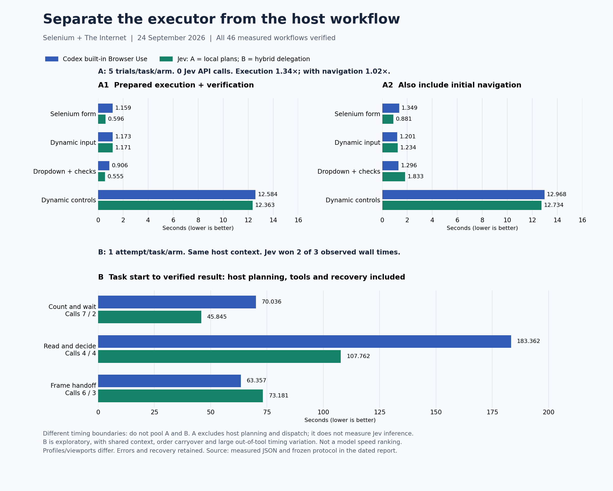

# Separate executor and host-workflow validation

**All 40 prepared executor trials and all six host workflows passed independent checks. The local-plan executor
was faster on execution alone, but almost tied after initial navigation. The hybrid host workflow won two of
three single attempts. These are different measurements, not a universal “faster than Codex” result.**

This follow-up keeps the [23 September experiment](../2026-09-23/report.md) intact. Its Jev arm deliberately included
semantic target inference while the built-in baseline received exact prepared controls. This experiment separates
that executor comparison from a host workflow that must observe, reason, write code and recover in real time.
The runtime binary was not changed between the experiments; this is validation of routing and measurement scope,
not a new runtime optimization or a controlled estimate of one code change's causal effect.

## A. Prepared execution: known controls on both sides

Five repetitions per workload and arm, alternating order, following a symmetric warm-up. Both arms received the
same already-observed control identities and supplied text. The Jev framework used **local conditional plans**;
all 20 Jev trials recorded **zero model decisions and zero API attempts**. This is not Jev model inference speed.

Seconds, lower is better. Each value is the median of five measurements, including verification.

| Workload | Built-in execution | Jev local execution | Built-in with initial navigation | Jev local with initial navigation |
| --- | ---: | ---: | ---: | ---: |
| Selenium form | 1.159 | 0.596 | 1.349 | 0.881 |
| Selenium dynamic input | 1.173 | 1.171 | 1.201 | 1.234 |
| The Internet dropdown + checkboxes | 0.906 | 0.555 | 1.296 | 1.833 |
| The Internet dynamic controls | 12.584 | 12.363 | 12.968 | 12.734 |
| Verified | 20 / 20 | 20 / 20 | 20 / 20 | 20 / 20 |

The geometric mean of the four built-in/Jev median ratios is **1.341× for execution** (25.4% shorter duration) and
**1.018× including initial navigation** (1.8% shorter). The latter is practically close to parity in this small sample.
Medians of phases do not necessarily add to the median of their sum.

The form and dropdown/checkbox execution improved most; the dynamic input was essentially tied. The final task
contains about 12 seconds of website-imposed waiting, leaving little removable overhead. Initial navigation to
the dropdown page had a 1.293 s median for Jev versus 0.390 s for built-in Browser Use, reversing that workflow's
execution advantage when initial navigation is included. No slow sample was discarded.

Timing uses `performance.now()` inside the actual interfaces. Execution includes actions, intermediate navigation,
readiness waits and independent verification. It excludes host reasoning, program authoring and outer dispatch.
Initial navigation/reset is measured separately and included in the last two columns. Every task gets a fresh
document; no cross-trial learned binding is used. Correctness requirements and values match the previous report.

An initial native warm-up used a closed tab captured by an older REPL function. Before formal measurement, the new
wrapper was changed to take the live Tab explicitly and both arms completed their warm-up. Those setup failures
are separate from the 40 measured trials; they were not silently counted as successful runs.

## B. Natural-language task through verified result

Three new task briefs, **one attempt per task per arm**, with no prepared per-task executable programs. A monotonic
host timer starts before the first task action and ends after final verification. It includes observation, host
reasoning, code/plan authoring, tool dispatch, browser work, actual errors and recovery. Prior connector setup and
later report production are excluded. There were no timed reruns or dropped attempts.

Both arms used the same native Codex host session. The second arm can benefit from the first arm's observations;
the order alternates but cannot remove that carryover. **This is an exploratory paired workflow study, not a blind
agent benchmark, an isolated model-latency test or a statistical performance estimate.**

| Task | First arm | Built-in wall time (s) | Jev hybrid wall time (s) | Browser tool calls, built-in / Jev | Verified |
| --- | --- | ---: | ---: | ---: | --- |
| Count and wait | Built-in | 70.036 | 45.845 | 7 / 2 | Both |
| Read and decide | Jev | 183.362 | 107.762 | 4 / 4 | Both |
| Frame handoff | Built-in | 63.357 | 73.181 | 6 / 3 | Both |

“Browser tool calls” counts host invocations, including failed attempts, not individual clicks or API requests.
The Jev table task also needed one documentation call, included in its wall time but listed separately from browser
calls. Timer start/end calls are instrumentation. Jev made **19 actual model API attempts** across this group.

### Actual tasks and evidence

- **Count and wait:** navigate from The Internet home to Add/Remove Elements; add three elements and delete two;
  independently count one remaining Delete button; return home and find Dynamic Loading Example 2; start once and
  verify the visible “Hello World!” result. Jev used two bounded goals separated by the independent count check.
  The native arm's first visible wait returned a selector deadline; the next DOM snapshot confirmed completion
  without repeating Start. Recovery is included in its 70.036 s.
- **Read and decide:** read the second table on Sortable Data Tables, select the maximum Due with stated tie-breaks,
  then submit its name/email to Selenium's synthetic form. Both read **Jason Doe, $100.00** and selected **Two**;
  Default checkbox was checked and Checked checkbox cleared. Pre-submit states and received query values were
  verified. Jev delegated table navigation, the host chose the row, and known form controls ran locally. The first
  host-authored plan omitted required `until.url.origin`; schema validation rejected it before execution. One
  documentation lookup, correction and successful single submission remain in the measured attempt.
- **Frame handoff:** navigate via Frames to Nested Frames; read actual LEFT, MIDDLE, RIGHT and BOTTOM frame contents;
  submit `LEFT | MIDDLE | RIGHT | BOTTOM`, label `Frame check` and option Three to Selenium. The native DOM snapshot
  was empty, so the host inspected frame structure and used supported frame locators. Jev returned
  `needs_host / unsupported_control`, with `unsupportedFrames: true`; the host stopped that goal, read real frame
  documents, then submitted via a local plan. One stale HANDOFF decision was rejected before a fresh handoff;
  neither decision dispatched a browser action. Both received values were independently verified.

The table checkpoint was a **planned host reasoning boundary**; the frame case was an **actual model-requested
unsupported-control handoff**. The count checkpoint was an independent assertion, not a model handoff. These
should not be conflated. Raw DONE claims were never accepted as proof of task success.

### Why the host times need caution

| Task | Built-in tool-reported duration sum (s) | Jev CLI-reported duration sum (s) |
| --- | ---: | ---: |
| Count and wait | 8.386 | 14.227 |
| Read and decide | 5.448 | 4.567 |
| Frame handoff | 4.105 | 8.753 |

These are **diagnostic durations with different tool reporting scopes**, not another fair executor ranking. The
host wall timer includes much larger intervals outside those reported durations. For example, the native table
attempt took 183.362 s with only 5.448 s reported inside its four browser tools. The remainder combines host
reasoning, code generation, orchestration, dispatch and scheduling. The available clocks cannot isolate these
causes, and the remainder must not be labelled “model thinking time.” We retained that sample as observed.

Reducing host calls helped the count workflow in this session. It did not guarantee a win on frames: Jev made
three host browser calls versus six, but took 73.181 s versus 63.357 s. The table task had the same browser-call
count on both sides, so its apparent wall-time win cannot be explained by fewer calls. Independent, repeated
contexts and better per-invocation timing are needed before making a stronger speed claim.

## Environment and interpretation

The same unreleased 0.1.0 binary was used throughout, SHA-256
`4948c0477875fee2c75d678b9c1772f65358a603e2cc280f258f05291cff4137`, branch
`feat/adaptive-browser-plans`, based on `264b2705f182212c55fdd3f1084a101212135cf3` plus working-tree changes.
macOS 26.5.2 arm64; Bun 1.3.14 for the compiled CLI. The Jev Chrome extension used the existing Chrome profile and
1920×830 viewport; Codex's supported built-in Browser Use used its separate in-app profile and 1280×720 viewport.
No runtime guard, viewport or user privacy setting was changed for the experiment. Network, rendering, profile,
cache and host scheduling remain confounders. The desktop AX Computer Use arm was not repeated in this experiment.

The evidence supports using local batches for exact known controls, bounded Jev navigation where it reduces host
turns, and native host reasoning or supported frame tools at capability boundaries. It does not show that Jev is
universally faster, that API latency equals task speed, or that handoffs are free. The all-local executor win does
not measure Jev's model, and the host study has only one observation per pair. **No comparative X promotion or
reply was published from this follow-up.** The previous publication gate was not changed retrospectively.

## Data and reproduction

- [Frozen protocol](protocol.md), [all 40 executor samples](executor-measured.json), [executor statistics](executor-summary.json).
- [All six host attempts](workflow-measured.json), including timestamps, original precision, retained errors,
  tool counts and compact Jev traces; [paired summary](workflow-summary.json); [public test-page evidence](workflow-evidence.json).
- [Harness and source hashes](source-manifest.json), [reproduction instructions](../../../bench/public-comparison/README.md).
  Full local browser diagnostics and credentials are excluded from public artifacts.

The chart is plotted from these measured JSON files, not generated as advertising artwork. Keep A and B separate;
never pool their timing boundaries, replace slower samples, or overwrite the previous dated experiment.
